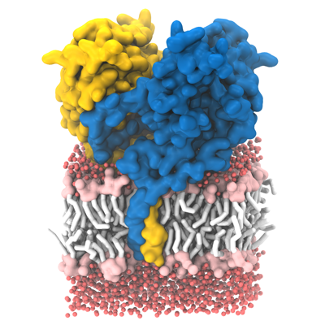
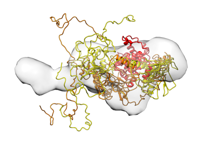
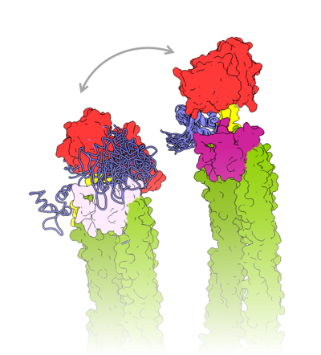
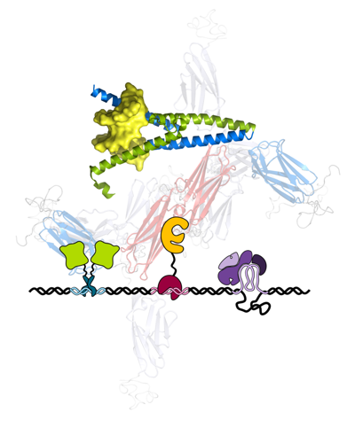

>Please, use the menu on the right (on mobile devices, the floating menu icon at lower left corner of the screen <i class="fas fa-bars"></i> ) to access other detailed information, including current research topics.

# Research

## Introduction

My research is conducted at the [Faculty of Chemistry and Chemical Technology](https://www.fkkt.uni-lj.si/){:target="_blank"}, [University of Ljubljana](https://www.uni-lj.si/){:target="_blank"}, in the labs of **Chair of Biochemistry**. I'm happy to have had the opportunity to contribute to the development of the chair since 2007 - from the lab at Jožef Stefan Institute, through temporary lab location, to the new building at [Večna pot 113, Ljubljana](https://goo.gl/maps/4G3CQf9CfW9epx7B8){:target="_blank"}.

My **Open Researcher and Contributor** profile is available via the ORCID link below:

<a itemprop="sameAs" content="https://orcid.org/0000-0002-2230-1758" href="https://orcid.org/0000-0002-2230-1758" target="orcid.widget" rel="me noopener noreferrer" style="vertical-align:top;">https://orcid.org/0000-0002-2230-1758</a>

Contact details:
: <i class="fas fa-building"></i> University of Ljubljana, Faculty of Chemistry and Chemical Technology, Chair of Biochemistry
: <i class="fas fa-globe-europe"></i> Večna pot 113, SI-1000 Ljubljana, Slovenia
: <i class="fas fa-phone"></i> +386 1 479 8550
: <i class="fas fa-at"></i> [miha.pavsic@fkkt.uni-lj.si](mailto:miha.pavsic@fkkt.uni-lj.si)
: 2nd floor, hallway 2A, room no. 2011

---

## Current research topics

 

  

    
  

  

    

      <h4><a href="epcam_trop2">Structural biology of tumor markers EpCAM and Trop2</a></h4>
    

    

      
EpCAM and Trop2, heart-shaped molecules helping epithelial cells to come tightly together by facilitating tight junction formation, get crazy in carcinomas - they are often overexpressed, and cut by different proteases to release signaling-associated fragments. Solving the first crystal structures of both proteins, we are focused to connect their structure to both functional similarity and funcional divergence.

    

  

 

  

    
  

  

    

      <h4><a href="testicans">Testicans</a></h4>
    

    

      
Providing the first overall structural insight into this protein group, we are interested how the protein core of these proteoglycans facilitates cell attachment and migration via interaction with cell-surface proteins.

    

  

 

  

    
  

  

    

      <h4><a href="actinins">Calcium-modulated human α-actinins</a></h4>
    

    

      
α-Actinin-1 and -4 are ubiquitous actin filament-crosslinkng proteins, and this activity is fundamental to support some of the basic cellular functions like maintaining cell shape, stability, attachment and movement. The crosslinking activity of these two actinins is modulated by calcium, and we work together with the group of Prof. Kristina Djinović-Carugo (University of Vienna) to decipher how these α-actinins contribute to the dynamic rearrangement of the actin filament suprastructures.

    

  

 

  

    
  

  

    

      <h4><a href="other">Collaborations and other topics</a></h4>
    

    

      
Diversity is key in many aspect of life, also in research. Tackling different problems widens horizons, contributes skill development and better equips one for future challenges. One of such projects is the structural characterization of human myotilin and its role in organization of the sarcomeric Z-disc protein complex (collaboration with Prof. Kristina Djinović-Carugo). Another topic is non-canonical structural DNA motifs (G-quadruplexes and other structures), specifically proteins recognizing them and binding to them (collaboration with Prof. Janez Plavec).

    

  

## Short history

My first hands-on experience with research work (not considering the practicals during my studies) was just before the start of the 2nd year of the 4-year study programme of **Biochemistry** at the **University of Ljubljana**, **Faculty of Chemistry and Chemical Technology**. With a classmate we decided to volunteer for a one month practice at the **National Institute of Chemistry** (Ljubljana, Slovenia) where we worked on 6-phosphofructo-1-kinase (PFK1) from *Aspergillus niger* under the mentorship of **Prof. Matic Legiša**.

During the 4rd study year, I joined **Prof. Brigita Lenarčič** at **Jožef Stefan Institute, Department of Biochemistry** (Ljubljana, Slovenia), and started working on the topic of thyroglobulin domain-containing proteins, focusing on the inhibitory role of these domains towards cysteine cathepsins. This research was later distilled into BSc and PhD theses.

Already during my PhD study of **Biomedicine** (**University of Ljubljana**, **Faculty of Medicine**) I participated as an assistant at students' practicals at the **University of Ljubljana, Faculty of Chemistry and Chemical Technology**. After finishing the PhD, I started working as a full-time assistant at this faculty, and continued working on the same group of proteins, however the focus shifted to their structural biology in connection with their role in normal physiological processes and disease, particulary in carcinoma. Indirectly, human calcium-sensitive α-actinins entered the list of my research topics, later joined by muscle protein myotilin (international collaboration, Prof. Kristina Djinović-Carugo) and several other topics. The most important ones are presented above.
