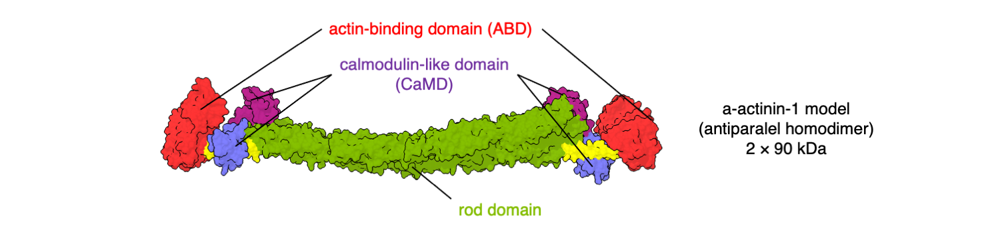
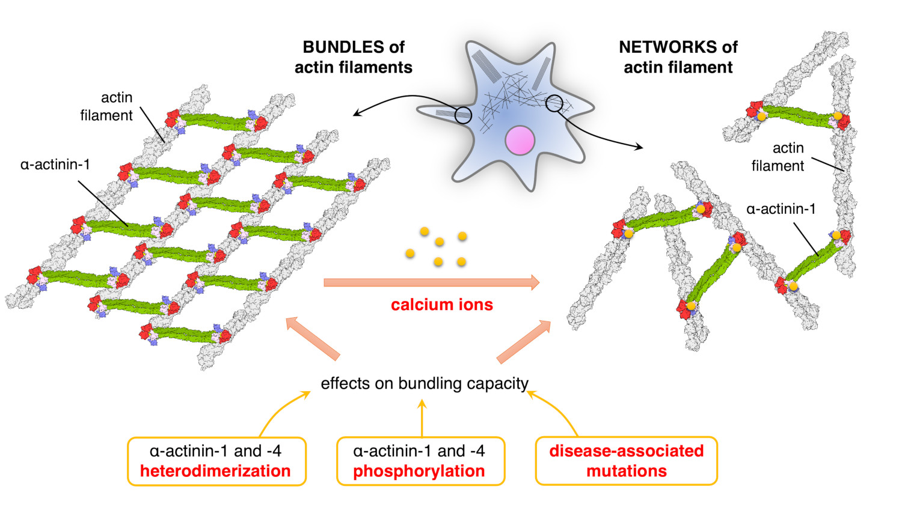

## Introduction

**Cytoskeleton** is a **complex supramolecular structure** within cells that helps them to maintain shape, stability and internal organization, as well as to perform various dynamic functions like movement. In this way it is analogous to the skeleton of complex multicellular organisms, however at a much smaller scale. The cytoskeleton is made up of different kinds of protein filaments and accessory proteins, which associate, dissociate and rearrange on-demand and in response to intra- and extracellular signals. Understanding its **structure, dynamics, regulation and function** is important both in fundamental science as well as in medicine where abnormal processes and mutations lead to cytoskeletal malfunctions and in turn to various diseases.

## Research focus

We focus on the the most dynamic type of cytoskeleton—**the actin cytoskeleton**, where actin filaments are organized into 3D-networks or tightly packed bundles held together by **ubiquitous proteins α-actinin-1 and -4**. They self-associate to form **homo-dimeric crosslinking units** with actin-binding region located at each end ([Fig. 1](#fig1)).

 

**Figure 1**: **Model of a homo-dimer of human α-actinin-1** which applies equally well to the α-actinin-4.

 

In particular, we are interested how the crosslinking mode of these two α-actinins is regulated. The main aspect appears to be **calcium-binding** to a specific region within α-actinin, and we hypothesize that α-actinin phosphorylation and association of both species to form **heterogeneous dimeric complexes** further adds to the complexity of this regulatory mechanism ([Fig. 2](#fig2)). By studying these events at the detailed molecular level, we aim to answer **how α-actinin-1 and -4 conformational plasticity is modulated by calcium binding**. This will in turn help to understand the regulation of adhesion contacts, cell protrusions and stress fibers, which are structures pivotal for cell adhesion and movement. Also, the results will deepen the understanding of structure and function of fundamental proteins α-actinin-1 and -4, pave the way for better understanding of the molecular basis of actinin-associated disease, and contribute to development of novel cell‐based technologies.

 

**Figure 2**: **Project overview.** Modulation of actin-binding of α-actinin by calcium ions, and implication of heterodimerization and post-translational modifications in the modulation mechanism.

 

Our research efforts are supported by the previous research results of the team where PhD student **Sara Drmota Prebil** demonstrated that the calmodulin-like domain (CaMD) of human α-actinin-1 binds a single calcium ion, and binding leads to ordering of the otherwise flexbile linker region within the CaMD ([Drmota Prebil et al., *Sci Rep*, 2016](https://doi.org/10.1038/srep27383){:target="_blank"}).

The research project is jointly run at **University of Vienna, Austria**, and **University of Ljubljana, Slovenia**, where the two collaborating groups led by [Prof. Kristina Djinović-Carugo](https://www.maxperutzlabs.ac.at/research/research-groups/djinovic){:target="_blank"} (University of Vienna) and Miha Pavšič (University of Ljubljana) are joining forces to tackle the project challenges. Project period: May 2021 - April 2024.

## Methods employed

The experimental part of the project involves diverse methods to study proteins both in isolated environment as well as in complex cellular setup. **Advanced methods of structural biology**, including protein crystallography and cryo-electron microscopy, and **cell biology approaches** will be employed and supplemented with assays aimed to study the actin filament bundling activity of α-actinin-1 and -4.

## Financing

  

    
  

  

    

      
The bilateral research project <b>Modulation of actin-binding of α-actinin by calcium ions</b> is co-financed by <a href="https://www.fwf.ac.at/en/">Der Wissenschaftsfonds FWF</a>, Austria (leading agency), and <a href="http://www.arrs.si/en/">Slovenian Research Agency</a> (ARRS, project no. N1-0191). Financing of previous research was through ARRS research grant no. J1-8151 (<b>Structural basis of calcium regulation of human α-actinin</b> (led by Prof. Kristina Djinović-Carugo) and young researchers' grant no. 33160, plus programme group no. P1-0140 (<b>Proteolysis and its regulation</b>, led by Prof. Boris Turk, Jožef Stefan Institute).

    

  

## Related publications
Sara Drmota Prebil, Urška Slapšak, **Miha Pavšič**, Gregor Ilc, Vid Puž, Euripedes de Almeida Ribeiro, Dorothea Anrather, Markus Hartl, Lars Backman, Janez Plavec, Brigita Lenarčič, and Kristina Djinović-Carugo. 2016. “Structure and Calcium-Binding Studies of Calmodulin-like Domain of Human Non-Muscle α-Actinin-1.” *Scientific Reports* 6: 27383. [10.1038/srep27383](https://doi.org/10.1038/srep27383)

