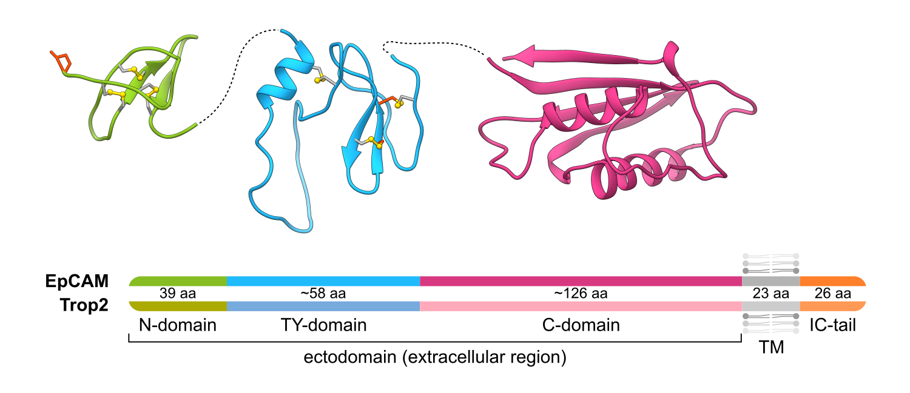
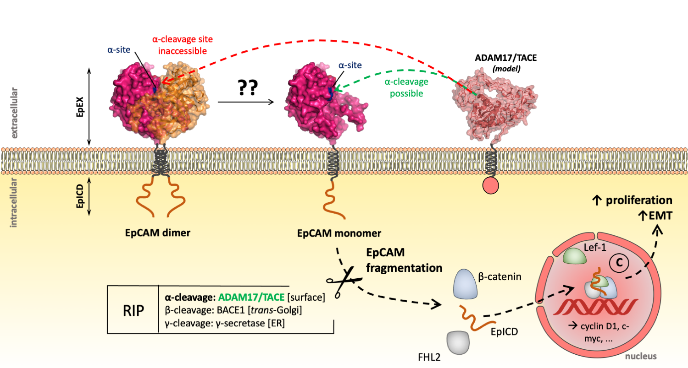
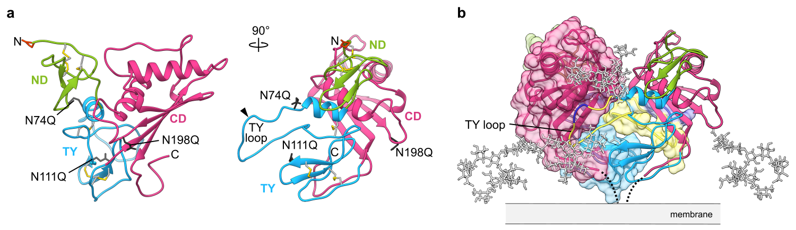
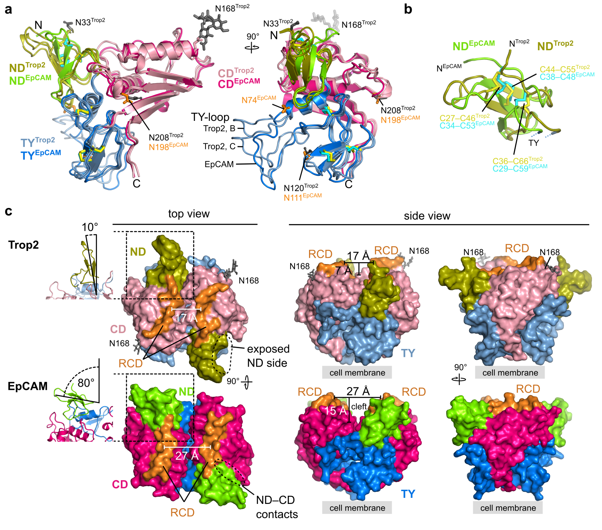
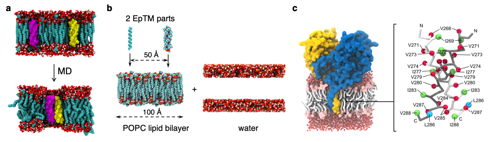
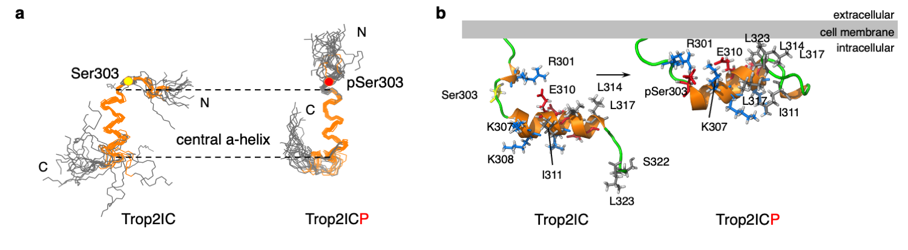

# EpCAM & Trop2

## Introduction

Carcinomas, cancers of epithelial origin, account for the vast majority of human cancers. Decades of research have revealed insights into carcinoma molecular biology, fueling considerable efforts to fight the disease, however numerous challenges remain, both at the basic science level as well as in the applied, therapeutic aspect. One of the hallmarks of cancer is enhanced and uncontrolled cell proliferation. We aim to add a piece to the puzzle by addressing **molecular events associated with proliferation-enhancing signaling**, specifically by focusing on **tumor marker proteins EpCAM and Trop2**, which are receiving a lot of attention as diagnostic, prognostic and therapeutics-delivery targets.

EpCAM and Trop2 are **transmembrane glycoproteins** of approx. 30 kDa - the ectodomain composed of three domains is via a single transmembrane helix connected to the short cytosolic tail ([Fig. 1](#fig1)).

 

**Figure 1**: **Topological and structural overview of EpCAM and Trop2.** Domain compostion of EpCAM and Trop2 (below) with structures of corresponding individual domains of EpCAM (above; PDB ID [4MZV](https://www.rcsb.org/structure/4MZV){:target="_blank"}). The small N-terminal domain (ND) has a core composed of three tightly-packed disulfide bridges, while the thyroglubulin domain (TY) features a characteristic disulfide linkage and long loop involved in EpCAM dimer stabilization.

 

EpCAM and Trop2 exert their functions though a **cascade of proteolytic events** at various sites within the ectodomain and transmembrane region (RIP - regulated intramembrane proteolysis, [Fig.2](#fig2); EpCAM proteolysis was described by our collaborator Prof. Olivier Gires, LMU München). These events eventually lead to the release and recruitment of their cytosolic tail into a nuclear complex involved in enchanced cell proliferation. Also, EpCAM and Trop2 are involved in interaction with several cell-surface proteins with implications in cell proliferation and epithelial-mesesenchymal transition.

 

**Figure 2**: **Regulated intramembrane proteolysis of EpCAM.** Shown is an overview of the events, and the cleavage process of Trop2 is similar.

 

## Contribution to the field

### Crystal structures

The most important achievements are detailed structural descriptions of the largest part of both EpCAM and Trop2, i.e. their ectodomains:
- **The first crystal structure of human EpCAM ectodomain** ([Fig. 3](#fig3), PDB ID [4MZV](https://www.rcsb.org/structure/4MZV){:target="_blank"}), which was for 5 years after publication the only and pivotal source of detail structural information on EpCAM ([Pavšič et al., *Nat Commun*](https://doi.org/10.1038/ncomms5764){:target="_blank"}).
- **The first crystal structure of human Trop2 ectodomain** (PDB ID [7PEE](https://www.rcsb.org/structure/7PEE){:target="_blank"}), published in 2021 ([Pavšič, *Int J Mol Sci*](https://doi.org/10.3390/ijms221910640){:target="_blank"}).

The structure of EpCAM ([Fig. 3](#fig3)) indicated that the ectodomain forms a **heart-shaped dimer** on the cells' surface where the **N-glycan chains help in maintaining the relative orientation** of the dimer with regard to the membrane plane. The structue provided the first insight into the accessibility of signaling-associated cleavage events where at least **partial dimer dissociation** appears to be neccessary for the initial cleavage to occur. Also, it demonstrated that cleavage with the TY loop, detected also *in vivo*, **destabilizes the dimer**. The structure also provided a possible explanation for the **high immunogenicity of the most exposed N-terminal domain**. In 2020, we published a **state-of-the-art review on EpCAM focusing on structure-function** relationship ([Gaber et al., *Cells*](https://doi.org/10.3390/cells9061361){:target="_blank"}).

 

**Figure 3**: **Structure of human EpCAM ectodomain.** (**a**) The three domains (N-terminal (ND), thyroglobulin (TY) and C-terminal domain (CD)) form a compact triangular arrangement. For crystallization, the three Asn residues were mutated to Gln to achieve higher sample homogeneiety. Cleavage at the protease-sensitive site within TY (arrow) destabilizes the ectodomain dimer. (**b**) Asn-attached glycan chains help in orienting the heart-shaped dimer with regard to the membrane plane (glycans were modeled). *Figure re-done using parts of figures from the published paper [Gaber et al., Cells, 2020](https://doi.org/10.3390/cells9061361){:target="_blank"} under Creative Common CC BY license.*

 

While **Trop2 shares a lof of overall structural features with EpCAM**, there are some **important differences** as revealed by the Trop2 ectodomain dimer structure ([Fig. 4](#fig4)): **the dimerization interface is larger** and appears to provide stronger subunit-subunit interactions than in EpCAM, **the relative orientation of small the N-terminal domain** with regard to the rest of the molecule is substationally different, and **the membrane-distal region is flatter** than in EpCAM. These differences are linked to the divergent evolutionary path the molecules took after the retroposition event giving rise to the Trop2 gene, and the implications of these structural differences in the function of these two molecules is in focus of our research efforts.

 

**Figure 4**: **Comparison structural features of EpCAM and Trop2.** (**a**) Structure superposition of human [EpCAM](https://www.rcsb.org/structure/4MZV) and [Trop2](https://www.rcsb.org/structure/7PEE) reveals a very similar overall fold. (**b**) While the overall fold of the small N-terminal domain is similar in EpCAM and Trop2, the structural differences revealed by the structure superposition and the low sequence identity (33 %) indicates significant divergence of this most immunogenic part of the molecule. (**c**) Surface representation of EpCAM and Trop2 ectodomains depicting difefernt N-terminal domain orientation and a flatter membrane-distal part of the molecule, further highlighting the divergent evolutionary path of EpCAM and Trop2. *Figure reused from the published paper [Pavšič, Int J Mol Sci, 2021](https://doi.org/10.3390/ijms221910640){:target="_blank"} under Creative Common CC BY license.*

 

### TM region

Using molecular dynamics simulations of EpCAM and Trop2 transmembrane helix, embedded in a lipid bilayer, I have demonstrated that **TM helices of both proteins can form stable homo-dimeric assembly** thereby additionally stabilizing the EpCAM/Trop2 dimer ([Fig. 5](#fig5)). This was separately shown both for EpCAM ([Pavšič et al., *Nat Commun*](https://doi.org/10.1038/ncomms5764){:target="_blank"}) and for Trop2 ([Pavšič et al., *Sci Rep*](https://doi.org/10.1038/srep10324){:target="_blank"}).

 

**Figure 5**: **Dimerization of TM region of EpCAM**. To investigate how transmembrane helix of two EpCAM molecules comes together to form a dimer (**a**), two copies of the cannonical helix (EpCAM amino acid sequence) were embedded in a lipid bilayer, surrounded by water layer, coarse-grained and equilibrated (2 microseconds) in a series of several molecular dynamics simulations (**b**). The final model of the EpCAM TM helix dimer reveals that the tetravaline motif together with the neighbouring Ile residue is the driving force for dimerization. Similarly was shown for the Trop2 with a pentavaline motif where several favourable dimers were identified.

 

TM helix dimerization could be implicated in intramembrane proteolysis of EpCAM and Trop2 by γ-secretase, as described in collaboration with the group of Prof. Olivier Gires, LMU München, Germany ([Tsaktanis et. al, *J Biol Chem*](https://doi.org/10.1074/jbc.M115.662700){:target="_blank"}).

### Cytosolic tail

In a joint effort with PhD student Tilen Vidmar and the group of Prof. Janez Plavec (National Institute of Chemistry, Ljubljana) we demonstrated that while the cytosolic tail of EpCAM is most probably unstructured, **the cytosolic tail of Trop2 features a central α-helix**. Here, **phoshphorylation** at Ser303, identified by other researchers, triggers a **conformational change** with ordering of the C-terminus ([Fig. 6](#fig6)), resulting in a more compact structure with implications in altered interactions with other proteins, e.g. protein kinase Cδ.

 

**Figure 6**: **Cytosolic tail of Trop2 as a phosphorylation-triggered switch**. Phosphorylation at Ser303 triggers salt bridge reshuffling, coupled to conformational changes - ordering of the C-teminal part. Trop2IC and Trop2ICP are non-phosphorylated and phosphorylated forms of the cytosolic tail, respectively.

 

## Our current challenges

Despite considerable advancement in the field, fuelled also by our crystal structures and other results (see [contribution](#contribution-to-the-field)), many questions remain unaswered. Currently, we are focusing on EpCAM & Trop2 **interactome**, particularly in the light of its effect on proteolytic cleavages (effect on EpCAM oligomeric state and the eccessibility of cleavage sites, recuitment of EpCAM into protease-rich membrane domains). This is currently being addressed by work of my PhD student **Tomaž Žagar**.

## Financing

  

    
  

  

    

      
The research was financed by grants from the <a href="http://www.arrs.si/en/">Slovenian Research Agency</a> (ARRS). Project grant numbers J1-2017 (<b>Epithelial Cell Adhesion Molecule (EpCAM), a target for tumor therapy: Structure, proteolytic processing and interaction with other proteins</b>) and J1-7119 (<b>EpCAM Biology at Structural Level as a Foundation for Efficient Tumor Targeting</b>), led by Prof. Brigita Lenarčič. Programme grant numbers P1-0207 (<b>Toxins and biomembranes</b>, led by Prof. Igor Križaj, Jožef Stefan Institute) and P1-0140 (<b>Proteolysis and its regulation</b>, led by Prof. Boris Turk, Jožef Stefan Institute).

    

  

---

## Related publications
1. **Miha Pavšič**. 2021. “Trop2 Forms a Stable Dimer with Significant Structural Differences within the Membrane-Distal Region as Compared to EpCAM.” *International Journal of Molecular Sciences* 22(19): 10640. [10.3390/ijms221910640](https://doi.org/10.3390/ijms221910640){:target="_blank"}
2. **Miha Pavšič**. 2021. "Dataset and analysis of molecular dynamics simulation of EpCAM ectodomain dimer." *Data in Brief* 38: 107403. [10.1016/j.dib.2021.107403](https://doi.org/10.1016/j.dib.2021.107403){:target="_blank"}
3. Tomaž Žagar, **Miha Pavšič**, and Aljaž Gaber. 2021. "Destabilization of EpCAM dimer is associated with increased susceptibility towards cleavage by TACE." *PeerJ* 3: e11484. [10.7717/peerj.11484](https://doi.org/10.7717/peerj.11484){:target="_blank"}
4. Aljaž Gaber, Brigita Lenarčič, and **Miha Pavšič**. 2020. “Current View on EpCAM Structural Biology.” *Cells* 9 (6): 1361. [10.3390/cells9061361](https://doi.org/10.3390/cells9061361)
5. Aljaž Gaber, Seung Joong Kim, Robyn M. Kaake, Mojca Benčina, Nevan Krogan, Andrej Šali, **Miha Pavšič**, and Brigita Lenarčič. 2018. “EpCAM Homo-Oligomerization Is Not the Basis for Its Role in Cell-Cell Adhesion.” *Scientific Reports* 8 (1): 13269. [10.1038/s41598-018-31482-7](https://doi.org/10.1038/s41598-018-31482-7)
6. Min Pan, Henrik Schinke, Elke Luxenburger, Gisela Kranz, Julius Shakhtour, Darko Libl, Yuanchi Huang, Aljaž Gaber, **Miha Pavšič**, Brigita Lenarčič, Julia Kitz, Sabina Schwenk-Zieger, Martin Canis, Julia Hess, Kristian Unger, Philipp Baumeister, and Olivier Gires. 2018. “EpCAM Ectodomain EpEX Is a Ligand of EGFR That Counteracts EGF-Mediated Epithelial-Mesenchymal Transition through Modulation of Phospho-ERK1/2 in Head and Neck Cancers.” *PLoS Biology* 16 (9): e2006624. [10.1371/journal.pbio.2006624](https://doi.org/10.1371/journal.pbio.2006624)
7. Thanos Tsaktanis, Heidi Kremling, **Miha Pavšič**, Ricarda von Stackelberg, Brigitte Mack, Akio Fukumori, Harald Steiner, Franziska Vielmuth, Volker Spindler, Zhe Huang, Jasmine Jakubowski, Nikolas H. Stöcklein, Elke Luxenburger, Kirsten Lauber, Brigita Lenarčič, and Olivier Gires. 2015. “Cleavage and Cell Adhesion Properties of Human Epithelial Cell Adhesion Molecule (HEPCAM).” *Journal of Biological Chemistry* 290 (40): 24574–91. [10.1074/jbc.M115.662700](https://doi.org/10.1074/jbc.M115.662700)
8. **Miha Pavšič**, Gregor Ilc, Tilen Vidmar, Janez Plavec, and Brigita Lenarčič. 2015. “The Cytosolic Tail of the Tumor Marker Protein Trop2–a Structural Switch Triggered by Phosphorylation.” *Scientific Reports* 5: 10324. [10.1038/srep10324](https://doi.org/10.1038/srep10324)
9. **Miha Pavšič**, Gregor Gunčar, Kristina Djinović-Carugo, and Brigita Lenarčič. 2014. “Crystal Structure and Its Bearing towards an Understanding of Key Biological Functions of EpCAM.” *Nature Communications* 5: 4764. [10.1038/ncomms5764](https://doi.org/10.1038/ncomms5764){:target="_blank"}
10. **Miha Pavšič**, and Brigita Lenarčič. 2011. "Expression, crystallization and preliminary X-ray characterization of the human epithelial cell-adhesion molecule ectodomain." *Acta Crystallographica. Section F, Structural biology and Crystallization Communications* 67(11): 1363-1366. [10.1107/S1744309111031897](https://doi.org/10.1107/S1744309111031897){:target="_blank"}

