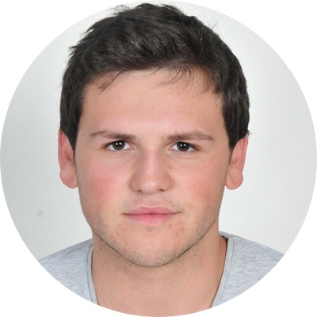
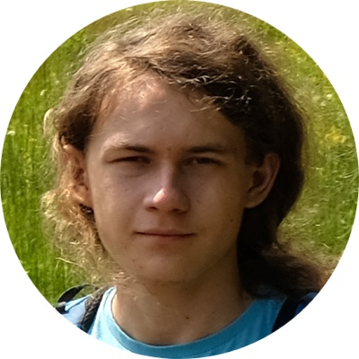
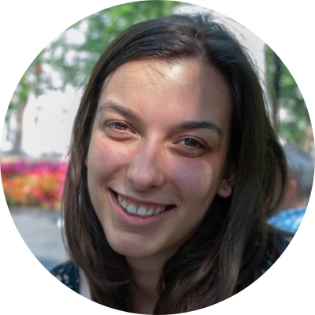
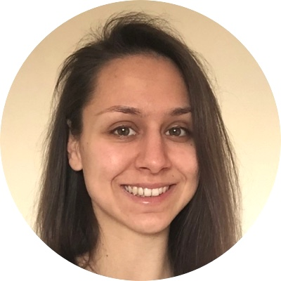
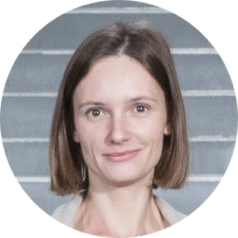

# Group members

## Current members

  

    
  

  

    

      <h4>Tomaž Žagar</h4>
    

    

      
Tomaž is a young researcher, working on signaling-related proteolytic cleavages of EpCAM in the light of its interactome. While EpCAM is throwing problems at him, Tomaž is throwing at it his creativity!

    

  

 

  

    
  

  

    

      <h4>Jošt Hočevar</h4>
    

    

      
Joined in 2021 as a member of the <a href="actinins">α-actinin project team</a> and a PhD student, Jošt is working on several aspects of the project.

    

  

 

  

    
  

  

    

      <h4>Andrej Ivanovski</h4>
    

    

      
Already a member of group since his diploma, Andrej's focus is on α-actinin-4, the other of the calcium-sensitive human α-actinins.

    

  

 

  

    
  

  

    

      <h4>Aljaž Simonič</h4>
    

    

      
Joined in 2021 as BSc student, working on EpCAM and Trop2 dynamics in solution.

    

  

 

## Former members

  

    
  

  

    

      <h4>Nika Tomsić</h4>
    

    

      
After enthusiastically spending some free time in the lab during the summer, Nika joined the group in 2021 as a BSc student with interest in tumor marker EpCAM.

    

  

 

  

    
  

  

    

      <h4>Andreja Habič</h4>
    

    

      
Andreja, a very enthusiastic student, joined already in the 2nd year of her BSc study, and was since then working on an <i>in vitro</i> <a href="other#non-canonical-dna-motifs">system for identification of proteins</a> interacting with a specific DNA sequence or a structural motif. Currently a PhD student at the National Institute of Chemistry, Ljubljana.

    

  

 

  

    
  

  

    

      <h4>Anja Krajnc</h4>
    

    

      
Group member in the period 2016–2021 as a PhD student. The center of Anja's attention was human <a href="testicans">testican-2</a> with her results being a solid base for future research on this proteoglycan family.

    

  

 
