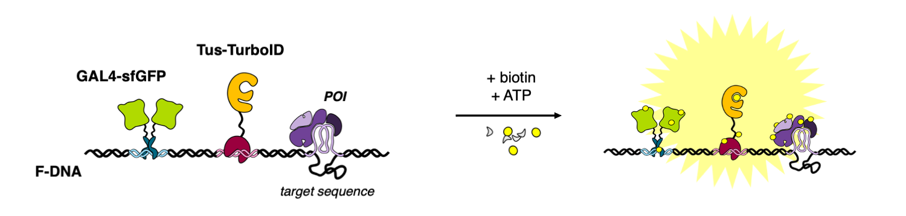

I am involved in several scientific collaborations, with two of the most intense ones involving **human muscle protein myotilin** and **non-canonical DNA structural motifs**.

## Myotilin

As part of the collaboration with the group of [Prof. Kristina Djinović-Carugo](https://www.maxperutzlabs.ac.at/research/research-groups/djinovic){:target="_blank"} (University of Vienna), I am participating in structural characterization of **human muscle protein myotilin** and its involvement in **organization of the multiprotein complex of Z-disc**, the delimiting unit of sarcomere.

Recently, we have described a **model of F-actin:myotilin complex** using a combination of experimental approaches (small-angle X-ray scattering, chemical crosslinking coupled to mass spectrometry, and other biochemical/biophysical approaches) ([Kostan and Pavšič et al., *PLoS Biology*, 2021](https://doi.org/10.1371/journal.pbio.3001148){:target="_blank"}). Currently, our efforts are directed to describe the myotilin oligomeric state in solution in detail, which would supplement the described mechanism of its role in sarcomere assembly.

### Publications

1. Julius Kostan a, **Miha Pavšič** a, Vid Puž, Thomas C. Schwarz, Friedel Drepper, Sibylle Molt, Melissa Ann Graewert, et al. 2021. “Molecular Basis of F-Actin Regulation and Sarcomere Assembly via Myotilin.” *PLoS Biology* 19 (4): e3001148. [10.1371/journal.pbio.3001148](https://doi.org/10.1371/journal.pbio.3001148) (a equal contribution)
2. Vid Puž, **Miha Pavšič**, Brigita Lenarčič, and Kristina Djinović-Carugo. 2017. “Conformational Plasticity and Evolutionary Analysis of the Myotilin Tandem Ig Domains.” *Scientific Reports* 7 (1): 3993. [10.1038/s41598-017-03323-6](https://doi.org/10.1038/s41598-017-03323-6)

## Non-canonical DNA motifs

In collaboration with the group of [Prof. Janez Plavec](http://www.slonmr.si/personnel/janez_plavec.php){:target="_blank"} (National Institute of Chemistry, Slovenia) we are focusing on identification of proteins interacting with non-canonical DNA structural motifs like G-quadruplexes and others.

While most of the work is still in progress, we already managed to establish a proof-of-concept system for identification of interaction partners of linear and other DNA motifs. The system based on proximity biotinylation by promiscuous biotin ligase ([Fig. 1](#fig1)) is described in theses of **Andreja Habič** (mentor: Miha Pavšič): [Development of a System for DNA-Protein Interaction Partners Discovery Based on Biotin Proximity Labeling](https://plus.si.cobiss.net/opac7/bib/1538309571){:target="_blank"} (BSc thesis, *in Slovene*) and [Characterisation,  Optimisation  and  Validation  of  a  System  for  DNA-Protein  Interaction Partners Discovery Based on Biotin Proximity Labeling](https://plus.si.cobiss.net/opac7/bib/78992131){:target="_blank"} (MSc thesis, *in Slovene*).

**Figure 1**: **Overview of the system for identification of proteins interacting with target sequence.** The promiscuous biotin ligase TurboID is brought to the synthetic DNA fragment via the Tus moiety, and upon ATP and biotin addition both the internal control (GAL4-sfGFP) and protein-of-interest (POI) are biotinylated. Following pull-down, the POI is identified by mass spectrometry. *Figure credit: Andreja Habič.*