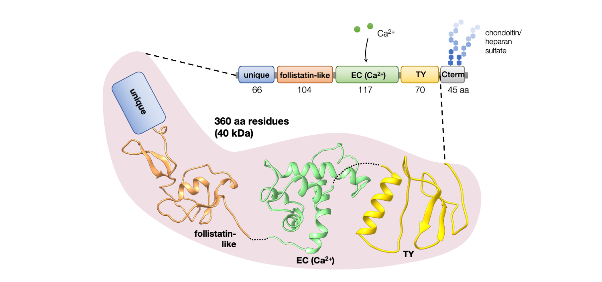
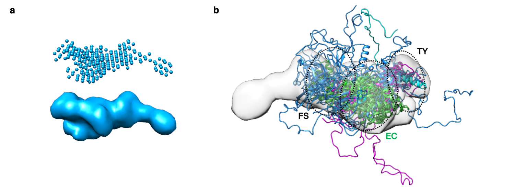

# Testicans

## Introduction

Neuropathological processes can significantly affect quality of life. Often, the underlying pathological processes are mostly not well understood which makes early diagnostics as well as treatment strategies less efficient. Even more, there are examples where neither normal nor the pathological role of the macromolecules and the processes in which they are involved is not clear. One such example is the **family of testicans, proteoglycans found in the neuronal tissue**. Recent studies indicate that they play an important role in development and maintenance of neuronal structures and also in regenerative processes after brain injury, however their mechanism of action is yet to be explained. Studies on murine model indicate that there is some level of functional redundancy among testicans.

Testicans-1, -2 and -3 are proteoglycans of the **BM-40/osteonectin/SPARC protein family** which share a common modular arrangement of follistatin-like domain (FS) followed by an extracellular calcium-binding domain (EC). In testicans, the FS domain is preceded by a region unique for testicans, while the EC domain is followed by a thyroglobulin-like domain (TY) and a C-terminal acidic region with two attachment sites for (predominantly) chondoitin and heparan sulfate chains (O-glycosylation) ([Fig. 1](#fig1)). The mass of the attached glycosaminoglycan (GAG) chains represents almost 70% of the complete molecule (approx. 130 kDa) (4). The pairwise sequence identity between the three testicans of the higher animals is approx. 50%.

 

**Figure 1**: **Overview of testican-2 domain organization.** Shown below are homology models of individual domains.

 

## Contribution to the field

Focusing on testican-2 as the representative member of the protein group, we have demonstratated ([Krajnc et al., *Int J Mol Sci*](https://doi.org/10.3390/ijms21249413){:target="_blank"}):
- The central domain triplet FS-EC-TY forms a **relatively compact core** ([Fig. 2](#fig2)), which is the first overall structural insight into the protein family.
- The **EC domain binds a single calcium ion**, and the binding contributes to the structure compactness.
- It is the protein core of the testicans, more precisely the FS-EC-TY domain triplet, that is responsible for **cell migration-enchancing function of testicans**.

 

**Figure 2**: **Testican-2 structural model derived using small angle X-ray scattering data (SAXS).** (**a**) The *ab initio* DAMMIF model of testican-2 contruct encompassing unique-FS-EC-TY domains, and (**b**) EOM model ensemble of the same construct fitted into the DAMMIF-generated envelope.

 

## Our current challenges

While the SAXS data-derived model does provide insight into the organization of the testicans' molecule, a **high-resolution structure** would be pivotal in further research of the role of these proteoglycans in cell differentiation, migration etc.

## Financing

  

    
  

  

    

      
The research was financed by grants from the <a href="http://www.arrs.si/en/">Slovenian Research Agency</a> (ARRS), young researcher grant no. 37408.

    

  

## Related publications

1. Anja Krajnc, Aljaž Gaber, Brigita Lenarčič, and **Miha Pavšič**. 2020. “The Central Region of Testican-2 Forms a Compact Core and Promotes Cell Migration.” *International Journal of Molecular Sciences* 21 (24): 17. [10.3390/ijms21249413](https://doi.org/10.3390/ijms21249413)
2. **Miha Pavšič**, Turk Vito, and Brigita Lenarčič. 2008. “Purification and Characterization of a Recombinant Human Testican-2 Expressed in Baculovirus-Infected Sf9 Insect Cells.” *Protein Expression and Purification* 58 (1): 132–39. [10.1016/j.pep.2007.09.010](https://doi.org/10.1016/j.pep.2007.09.010)
3. Primož Meh, **Miha Pavšič**, Vito Turk, Antonio Baici, and Brigita Lenarčič. 2005. “Dual Concentration-Dependent Activity of Thyroglobulin Type-1 Domain of Testican: 2.Specific Inhibitor and Substrate of Cathepsin L.” *Biological Chemistry* 386 (1): 75–83. [10.1515/BC.2005.010](https://doi.org/10.1515/BC.2005.010)
